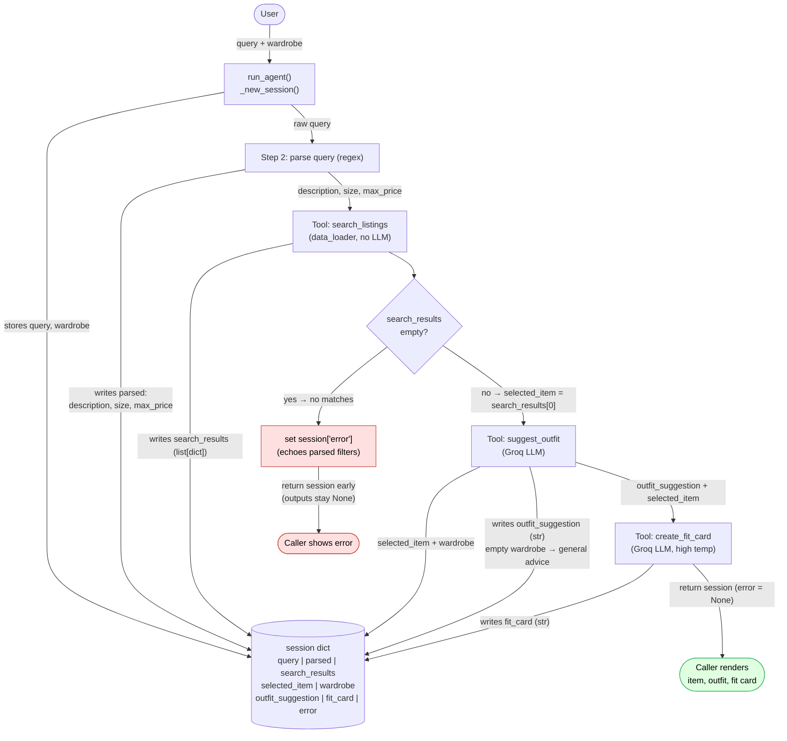

# FitFindr — planning.md

> Complete this document before writing any implementation code.
> Your spec and agent diagram are what you'll use to direct AI tools (Claude, Copilot, etc.) to generate your implementation — the more specific they are, the more useful the generated code will be.
> Your planning.md will be reviewed as part of your submission.
> Update it before starting any stretch features.

---

## Tools

List every tool your agent will use. For each tool, fill in all four fields.
You must have at least 3 tools. The three required tools are listed — add any additional tools below them.

### Tool 1: search_listings

**What it does:**
<!-- Describe what this tool does in 1–2 sentences -->
It searches the mock listings dataset (`data/listings.json`) and returns the listings that match the user's keyword description. Results are ranked by keyword relevance so the best match comes first.

**Input parameters:**
<!-- List each parameter, its type, and what it represents -->
- `description` (str): Free-text keywords describing what the user wants. Used to score relevance against each listing's `title`, `description`, and `style_tags`.
- `size` (str): Size string to filter by. Matching is case-insensitive and substring-based, so `"M"` matches a listing sized `"S/M"`. Pass `None` to skip size filtering. Optional parameter (default `None`).
- `max_price` (float): Inclusive price ceiling in dollars. Listings priced above this are excluded. Pass `None` to skip price filtering. Optional parameter (default `None`).

**What it returns:**
<!-- Describe the return value — what fields does a result contain? -->
A `list[dict]` sorted by descending relevance (best match first), with every zero-score listing dropped. Each element is a listing dict with these fields: `id` (str), `title` (str), `description` (str), `category` (str: tops/bottoms/outerwear/shoes/accessories), `style_tags` (list[str]), `size` (str), `condition` (str: excellent/good/fair), `price` (float), `colors` (list[str]), `brand` (str | None), `platform` (str: depop/thredUp/poshmark). Returns `[]` when nothing matches.

**What happens if it fails or returns nothing:**
<!-- What should the agent do if no listings match? -->
The function returns `[]` on no match. The agent does not call `suggest_outfit`. Instead it sets `session["error"]` to a helpful message echoing the parsed filters (e.g. *"No listings matched 'designer ballgown' under $5 in size XXS. Try loosening the price or describing the item differently."*) and returns the session early.

---

### Tool 2: suggest_outfit

**What it does:**
<!-- Describe what this tool does in 1–2 sentences -->
Takes the listing the user is considering plus the user's wardrobe and asks the LLM (Groq) to suggest 1-2 complete, wearable outfits that combine the new item with specific pieces the user already owns. Handles an empty or minimal wardrobe by giving general styling advice instead.

**Input parameters:**
<!-- List each parameter, its type, and what it represents -->
- `new_item` (dict): A single listing dict (top result) from `search_listings`. The tool reads its `title`, `category`, `colors`, `style_tags`, and `description` into the prompt.
- `wardrobe` (dict): A wardrobe dict with an `"items"` key holding a `list[dict]`. Each wardrobe item has `id` (str), `name` (str), `category` (str), `colors` (list[str]), `style_tags` (list[str]), and `notes` (str | None). May be empty (`{"items": []}`).

**What it returns:**
<!-- Describe the return value -->
A non-empty `str` of natural-language styling advice. When the wardrobe has items, it names 1–2 outfits referencing specific wardrobe pieces by `name` plus the new item (e.g. *"Pair the butterfly baby tee with your baggy straight-leg jeans and chunky white sneakers…"*). When the wardrobe is empty, it returns general styling advice for the item (what categories/colors/vibes pair well) rather than references to owned pieces.

**What happens if it fails or returns nothing:**
<!-- What should the agent do if the wardrobe is empty or no outfit can be suggested? -->
If `wardrobe["items"]` is empty, the tool indicates that to the user, branches to the general-styling-advice prompt and still returns a useful non-empty string. If the Groq API call raises (network/auth/rate limit), the tool catches the exception and returns a plain-text fallback such as *"Couldn't generate a styled outfit right now, but this {category} in {colors} works well with neutral basics."* so the agent can still continue. The agent treats any non-empty return as success.

---

### Tool 3: create_fit_card

**What it does:**
<!-- Describe what this tool does in 1–2 sentences -->
Turns an outfit suggestion plus the item details into a short, shareable description of a complete outfit (Instagram post caption style) for the thrifted find. Uses the LLM at a higher temperature so repeated calls read differently for different inputs.

**Input parameters:**
<!-- List each parameter, its type, and what it represents -->
- `outfit` (str): The styling string returned by `suggest_outfit()`. Provides the vibe/context for the caption.
- `new_item` (dict): The same listing dict used in `suggest_outfit`. The tool pulls `title`, `price`, and `platform` to mention each naturally once in the caption.

**What it returns:**
<!-- Describe the return value -->
A `str` of 2–4 sentences usable as a caption. It mentions the item name, price, and platform once each, captures the outfit vibe in specific terms, and sounds casual/authentic rather than like a product description.

**What happens if it fails or returns nothing:**
<!-- What should the agent do if the outfit data is incomplete? -->
If `outfit` is `None`, empty, or whitespace-only, the tool returns a descriptive error string (e.g. *"Can't build a fit card without an outfit suggestion."*) instead of calling the LLM. If the Groq call raises, it catches the exception, indicates what is going on to the user, and returns a simple deterministic fallback caption built from `new_item` fields (e.g. *"Thrifted the {title} for ${price} on {platform}. 🔥"*) so the user always sees a card.

---

### Additional Tools (if any)

<!-- Copy the block above for any tools beyond the required three -->

---

## Planning Loop

**How does your agent decide which tool to call next?**
<!-- Describe the logic your planning loop uses. What does it look at? What conditions change its behavior? How does it know when it's done? -->

The loop is a state-driven pipeline with a real conditional branch. After each tool returns, the agent inspects what came back (stored on `session`) and decides whether to continue, exit early, or change which prompt path the next tool takes. The `session` dict is the single source of state passed between steps.

1. **Initialize.** `session = _new_session(query, wardrobe)`. All result fields start as `None`/`[]`, `error` is `None`.

2. **Parse the query.** Extract `description`, `size`, `max_price` from `query` and store them in `session["parsed"]`.
   - `max_price`: regex-match a dollar amount after "under"/"below"/"$" (e.g. `under $30` -> `30.0`); else `None`.
   - `size`: regex-match a size token after the word "size", or a standalone `XS|S|M|L|XL|XXL` token (e.g. `size M` -> `"M"`); else `None`.
   - `description`: the query with the matched price and size phrases stripped out and trimmed (e.g. `"vintage graphic tee"`); falls back to the raw query.

3. **Call `search_listings(description, size, max_price)`** and store the list in `session["search_results"]`.
   **Branch: inspect the result before choosing the next tool:**
   - **If `search_results` is empty:** set `session["error"]` to a helpful message that echoes the parsed filters, and **return the session immediately.** Do not call `suggest_outfit` or `create_fit_card`. (`outfit_suggestion` and `fit_card` stay `None`.)
   - **If `search_results` is non-empty:** set `session["selected_item"] = session["search_results"][0]` (top-ranked) and proceed to step 4.

4. **Call `suggest_outfit(selected_item, wardrobe)`** and store the string in `session["outfit_suggestion"]`. The tool itself inspects `wardrobe["items"]` and picks its prompt path (specific outfits vs. general advice), so the agent does not exit here. `suggest_outfit` is contracted to always return a non-empty string, so the loop proceeds unconditionally.

5. **Call `create_fit_card(outfit_suggestion, selected_item)`** and store the string in `session["fit_card"]`.

6. **Return `session`.** On success `error` is `None`, and `selected_item`, `outfit_suggestion`, and `fit_card` are all populated.

**How it knows it's done:** the pipeline either reaches step 6 (success) or returns early at step 3 (no results). There is no retry/iteration, but exactly 1 pass, with the step-3 branch being the point where the agent responds to what it received instead of blindly continuing.

---

## State Management

**How does information from one tool get passed to the next?**
<!-- Describe how your agent stores and accesses state within a session. What data is tracked? How is it passed between tool calls? -->

A single `session` dict (created by `_new_session()`) is the one source of truth for the whole interaction. Each step writes its output into a named field; the next step reads from that field. Every hand-off is an explicit read/write on `session`. Critically, the item found by `search_listings` flows into `suggest_outfit` (and then `create_fit_card`) via `session["selected_item"]` without the user re-entering it.

| Field | Written by | Read by |
|-------|-----------|---------|
| `query` | `_new_session` (input) | Step 2 parser |
| `parsed` (`{description, size, max_price}`) | Step 2 parser | Step 3 `search_listings` args |
| `search_results` (list[dict]) | Step 3 | Step 3 branch + step 4 selection |
| `selected_item` (dict) | Step 4 selection (`search_results[0]`) | `suggest_outfit`, `create_fit_card` |
| `wardrobe` (dict) | `_new_session` (input) | `suggest_outfit` |
| `outfit_suggestion` (str) | Step 4 | `create_fit_card`, final output |
| `fit_card` (str) | Step 5 | final output |
| `error` (str \| None) | any early-exit step | caller checks first |

The caller (`app.py` / CLI) reads `session["error"]` first: if non-`None`, it shows the error and ignores the (still-`None`) output fields; otherwise it renders `selected_item`, `outfit_suggestion`, and `fit_card`.

---

## Error Handling

For each tool, describe the specific failure mode you're handling and what the agent does in response.

| Tool | Failure mode | Agent response |
|------|-------------|----------------|
| search_listings | No results match the query (returns `[]`) | Agent stops at the step-3 branch and sets `session["error"]` to a helpful message echoing the parsed filters and offering a concrete next move, e.g. *"No listings matched 'designer ballgown' under $5 in size XXS. Try loosening the price or describing the item differently."* It does not call `suggest_outfit`/`create_fit_card` and returns the session early so the user can resubmit with looser criteria. |
| suggest_outfit | Wardrobe is empty (`wardrobe["items"] == []`) | Not a hard error: the tool indicates the empty wardrobe to the user, branches to the general-styling-advice prompt, and still returns a useful non-empty string about what colors/categories/vibes pair with the item. If the Groq call raises, it catches the exception and returns the deterministic fallback *"Couldn't generate a styled outfit right now, but this {category} in {colors} works well with neutral basics."*, and the agent still continues to `create_fit_card`. |
| create_fit_card | Outfit input is missing or incomplete (`None`/empty/whitespace) | The tool skips the LLM and returns a descriptive string stored in `session["fit_card"]`: *"Can't build a fit card without an outfit suggestion."* If instead the Groq call raises, it catches the exception, indicates what's going on, and returns a simple deterministic caption built from `new_item` (*"Thrifted the {title} for ${price} on {platform}. 🔥"*) so the user always leaves with a usable card rather than a crash. |

---

## Architecture

<!-- Draw a diagram of your agent showing how the components connect:
     User input → Planning Loop → Tools (search_listings, suggest_outfit, create_fit_card)
                                                                          ↕
                                                                   State / Session
     Show what triggers each tool, how state flows between them, and where error paths branch off.
     ASCII art, a Mermaid diagram (https://mermaid.js.org/syntax/flowchart.html), or an embedded
     sketch are all fine. You'll share this diagram with an AI tool when asking it to implement
     the planning loop and each individual tool. -->

**Mermaid diagram code block:**

---

## AI Tool Plan

<!-- For each part of the implementation below, describe:
     - Which AI tool you plan to use (Claude, Copilot, ChatGPT, etc.)
     - What you'll give it as input (which sections of this planning.md, your agent diagram)
     - What you expect it to produce
     - How you'll verify the output matches your spec before moving on

     "I'll use AI to help me code" is not a plan.
     "I'll give Claude my Tool 1 spec (inputs, return value, failure mode) and ask it to implement
     search_listings() using load_listings() from the data loader — then test it against 3 queries
     before trusting it" is a plan. -->

**Milestone 3 — Individual tool implementations:**
- *search_listings():* I will give Claude Code my Tool 1 specification (inputs, return value, failure mode) from planning.md and ask it to implement search_listings() using load_listings from the data loader. To verify the output, I will test it against 3 different queries and write one pytest test per failure mode.
- *suggest_outfit():* I will give Claude Code my Tool 2 specification (inputs, return value, failure mode) from planning.md and ask it to implement search_listings() using load_listings from the data loader. To verify the output, I will test it against the example wardrobe and listing and write one pytest test per failure mode.
- *create_fit_card():* I will give Claude Code my Tool 3 specification (inputs, return value, failure mode) from planning.md and ask it to implement search_listings() using load_listings from the data loader. To verify the output, I will test it against 3 different queries and write one pytest test per failure mode.

**Milestone 4 — Planning loop and state management:**

---

## A Complete Interaction (Step by Step)

Write out what a full user interaction looks like from start to finish — tool call by tool call. Use a specific example query.

**Example user query:** "I'm looking for a vintage graphic tee under $30. I mostly wear baggy jeans and chunky sneakers. What's out there and how would I style it?"

**Step 1:**
<!-- What does the agent do first? Which tool is called? With what input? -->
The agent searches the listings first. It calls the tool search_listings("vintage graphic tee", size="M", max_price=30.0) which returns 3 matching listings sorted by relevance. FitFindr picks the top result: "Faded Band Tee — $22, Depop, Good condition."

**Step 2:**
<!-- What happens next? What was returned from step 1? What tool is called now? -->
Because Step 1 returned a non-empty list, the agent stored the Faded Band Tee as `session["selected_item"]` and now calls `suggest_outfit(new_item=<band tee>, wardrobe=<user's wardrobe>)`. The item flows in from state, so the user never re-enters it. The wardrobe has items, so the tool takes its specific-outfit prompt path and returns: *"Pair this with your wide-leg jeans and platform Docs for a classic 90s grunge look. Roll the sleeves once and tuck the front corner slightly for shape."* This string is saved to `session["outfit_suggestion"]`.

**Step 3:**
<!-- Continue until the full interaction is complete -->
With a non-empty outfit suggestion in hand, the agent calls `create_fit_card(outfit=<suggestion>, new_item=<band tee>)`, passing both the outfit string and the same selected item from state. Run at a higher temperature, it returns a casual caption that names the item, price, and platform once: *"thrifted this faded band tee off depop for $22 and honestly it was made for my wide-legs 🖤 full look in my stories."* This is stored in `session["fit_card"]`, and with `error` still `None` the loop returns the completed session.

**Final output to user:**
<!-- What does the user actually see at the end? -->
Since `session["error"]` is `None`, the caller renders the full result: the matched listing (Faded Band Tee — $22, Depop, good condition), the outfit suggestion pairing it with the user's wide-leg jeans and platform Docs, and the ready-to-post fit card caption.

---

## Test Results

### **pytest tests: `python -m pytest tests/test_tools.py -v`**

OUTPUT:

========================================== test session starts ==========================================
platform win32 -- Python 3.14.5, pytest-9.0.3, pluggy-1.6.0 -- C:\Users\halde\OneDrive\Desktop\CodePath\AI 201 Summer 2026\ai201-project2-fitfindr-starter\.venv\Scripts\python.exe
cachedir: .pytest_cache
rootdir: C:\Users\halde\OneDrive\Desktop\CodePath\AI 201 Summer 2026\ai201-project2-fitfindr-starter
plugins: anyio-4.13.0
collected 7 items                                                                                        

tests/test_tools.py::test_search_returns_results PASSED                                            [ 14%]
tests/test_tools.py::test_search_empty_results PASSED                                              [ 28%]
tests/test_tools.py::test_search_price_filter PASSED                                               [ 42%]
tests/test_tools.py::test_suggest_outfit_empty_wardrobe PASSED                                     [ 57%]
tests/test_tools.py::test_suggest_outfit_api_failure_returns_fallback PASSED                       [ 71%]
tests/test_tools.py::test_create_fit_card_empty_outfit_returns_error PASSED                        [ 85%]
tests/test_tools.py::test_create_fit_card_api_failure_returns_fallback PASSED                      [100%]

=========================================== 7 passed in 0.28s ===========================================

### **`search_listings()`: 3 queries**

#### QUERY 1: `python -c "from tools import search_listings; print(search_listings('vintage graphic tee', max_price=50))"`

OUTPUT:

[{'id': 'lst_002', 'title': 'Y2K Baby Tee — Butterfly Print', 'description': 'Super cute early 2000s baby tee with butterfly graphic. Fitted crop length. Tag says medium but fits like a small.', 'category': 'tops', 'style_tags': ['y2k', 'vintage', 'graphic tee', 'cottagecore'], 'size': 'S/M', 'condition': 'excellent', 'price': 18.0, 'colors': ['white', 'pink', 'purple'], 'brand': None, 'platform': 'depop'}, {'id': 'lst_006', 'title': 'Graphic Tee — 2003 Tour Bootleg Style', 'description': 'Vintage-style bootleg tee with faded graphic. Slightly boxy fit. 100% cotton, soft and worn-in.', 'category': 'tops', 'style_tags': ['graphic tee', 'vintage', 'grunge', 'streetwear', 'band tee'], 'size': 'L', 'condition': 'good', 'price': 24.0, 'colors': ['black'], 'brand': None, 'platform': 'depop'}, {'id': 'lst_033', 'title': 'Vintage Band Tee — Faded Grey', 'description': 'Faded grey band-style tee with distressed graphic. Crew neck. Fits boxy. Well-loved but no holes or major damage.', 'category': 'tops', 'style_tags': ['vintage', 'grunge', 'band tee', 'graphic tee', 'streetwear'], 'size': 'L', 'condition': 'fair', 'price': 19.0, 'colors': ['grey', 'charcoal'], 'brand': None, 'platform': 'depop'}, {'id': 'lst_012', 'title': 'Oversized Crewneck Sweatshirt — Vintage Navy', 'description': 'Perfectly faded navy crewneck. Genuinely vintage — not manufactured distressed. Ribbed cuffs and hem. No graphics, clean.', 'category': 'tops', 'style_tags': ['vintage', 'basics', 'oversized', 'classic'], 'size': 'XL (fits oversized)', 'condition': 'good', 'price': 20.0, 'colors': ['navy'], 'brand': None, 'platform': 'thredUp'}, {'id': 'lst_015', 'title': 'Vintage Graphic Hoodie — Faded Black', 'description': 'Faded black pullover hoodie with barely-visible vintage graphic on the chest. Cozy interior. Some pilling but adds to the worn-in look.', 'category': 'tops', 'style_tags': ['vintage', 'grunge', 'graphic', 'streetwear'], 'size': 'L', 'condition': 'fair', 'price': 26.0, 'colors': ['black', 'charcoal'], 'brand': None, 'platform': 'depop'}, {'id': 'lst_017', 'title': 'Mesh Long-Sleeve Top — Black', 'description': 'Sheer black mesh long-sleeve. Great for layering under a graphic tee or over a bralette. Stretchy material, fits true to size.', 'category': 'tops', 'style_tags': ['y2k', 'grunge', 'goth', 'layering'], 'size': 'S/M', 'condition': 'excellent', 'price': 15.0, 'colors': ['black'], 'brand': None, 'platform': 'depop'}, {'id': 'lst_001', 'title': "Vintage Levi's 501 Jeans — Medium Wash", 'description': 'Classic 501s in a perfect medium wash. Some light fading at the knees which adds to the vintage look. No rips or stains.', 'category': 'bottoms', 'style_tags': ['vintage', 'classic', 'denim', 'streetwear'], 'size': 'W30 L30', 'condition': 'good', 'price': 38.0, 'colors': ['blue', 'indigo'], 'brand': "Levi's", 'platform': 'depop'}, {'id': 'lst_003', 'title': 'Oversized Flannel Shirt — Plaid Red/Black', 'description': 'Classic oversized flannel. Great layering piece. A few tiny pulls in the fabric but nothing visible when worn.', 'category': 'tops', 'style_tags': ['grunge', 'vintage', 'flannel', 'streetwear', 'layering'], 'size': 'XL (oversized)', 'condition': 'good', 'price': 22.0, 'colors': ['red', 'black'], 'brand': 'Woolrich', 'platform': 'thredUp'}, {'id': 'lst_004', 'title': '90s Track Jacket — Navy/White Stripe', 'description': 'Authentic 90s track jacket with stripe detail down the sleeves. Full zip. Lightweight — great for layering.', 'category': 'outerwear', 'style_tags': ['90s', 'vintage', 'athletic', 'streetwear'], 'size': 'M', 'condition': 'excellent', 'price': 45.0, 'colors': ['navy', 'white'], 'brand': 'Champion', 'platform': 'poshmark'}, {'id': 'lst_005', 'title': 'Corduroy Wide-Leg Pants — Rust', 'description': 'Beautiful rust-colored cords in a wide-leg silhouette. High-waisted. Minor pilling on the seat but otherwise great condition.', 'category': 'bottoms', 'style_tags': ['vintage', 'cottagecore', '70s', 'earth tones'], 'size': 'W28', 'condition': 'good', 'price': 32.0, 'colors': ['rust', 'orange'], 'brand': None, 'platform': 'depop'}, {'id': 'lst_007', 'title': 'Denim Jacket — Light Wash, Cropped', 'description': 'Cropped denim jacket in a light wash. Great structured shoulders. Blank canvas — no patches or pins but would be perfect to customize.', 'category': 'outerwear', 'style_tags': ['denim', 'vintage', 'classic', 'streetwear'], 'size': 'S', 'condition': 'excellent', 'price': 42.0, 'colors': ['light blue'], 'brand': 'Wrangler', 'platform': 'poshmark'}, {'id': 'lst_010', 'title': 'Vintage Windbreaker — Color Block Purple/Teal', 'description': 'Color block windbreaker from the early 90s. Packable, lightweight. The kind your dad definitely owned. Full zip with elastic cuffs.', 'category': 'outerwear', 'style_tags': ['90s', 'vintage', 'athletic', 'color block', 'streetwear'], 'size': 'L', 'condition': 'good', 'price': 40.0, 'colors': ['purple', 'teal', 'black'], 'brand': None, 'platform': 'thredUp'}, {'id': 'lst_011', 'title': 'Low-Rise Cargo Pants — Khaki', 'description': 'Y2K era low-rise cargo pants. Lots of pockets. Khaki color, slightly distressed at the hems. Great for layering with a long tee.', 'category': 'bottoms', 'style_tags': ['y2k', 'cargo', '2000s', 'streetwear'], 'size': 'W29', 'condition': 'fair', 'price': 27.0, 'colors': ['khaki', 'tan'], 'brand': None, 'platform': 'poshmark'}, {'id': 'lst_013', 'title': '90s Silk Slip Dress — Floral, Midi Length', 'description': 'Delicate 90s slip dress in a muted floral print. Midi length, adjustable straps. Light snag on the side seam — not visible when worn.', 'category': 'bottoms', 'style_tags': ['90s', 'vintage', 'feminine', 'floral', 'cottagecore'], 'size': 'M', 'condition': 'good', 'price': 30.0, 'colors': ['ivory', 'dusty pink', 'green'], 'brand': None, 'platform': 'depop'}, {'id': 'lst_014', 'title': 'Leather Belt — Brown, Braided', 'description': 'Genuine leather braided belt. Adjustable, multiple holes. Classic Western buckle. Can be dressed up or down.', 'category': 'accessories', 'style_tags': ['vintage', 'western', 'classic', 'earth tones'], 'size': 'One Size (adjustable)', 'condition': 'excellent', 'price': 12.0, 'colors': ['brown'], 'brand': None, 'platform': 'thredUp'}, {'id': 'lst_016', 'title': 'High-Waisted Denim Shorts — Cutoff', 'description': "DIY cutoff denim shorts from Levi's 501s. Raw hem, slightly frayed. High-waisted. Perfect summer length.", 'category': 'bottoms', 'style_tags': ['vintage', 'denim', 'summer', 'classic'], 'size': 'W27', 'condition': 'good', 'price': 24.0, 'colors': ['light blue', 'blue'], 'brand': "Levi's", 'platform': 'poshmark'}, {'id': 'lst_018', 'title': 'Vintage Linen Blazer — Cream', 'description': 'Lightweight linen blazer in cream. Relaxed fit, unstructured shoulders. Two front pockets. Could be dressed up or styled casually.', 'category': 'outerwear', 'style_tags': ['vintage', 'classic', 'linen', 'cottagecore', 'minimal'], 'size': 'M/L', 'condition': 'excellent', 'price': 38.0, 'colors': ['cream', 'off-white'], 'brand': None, 'platform': 'thredUp'}, {'id': 'lst_020', 'title': 'Henley Long Sleeve — Washed Burgundy', 'description': 'Soft washed henley in a rich burgundy. Three-button placket. Slightly shrunken/cropped fit. 100% cotton.', 'category': 'tops', 'style_tags': ['vintage', 'basics', 'earth tones', 'classic'], 'size': 'M', 'condition': 'excellent', 'price': 16.0, 'colors': ['burgundy', 'wine'], 'brand': None, 'platform': 'thredUp'}, {'id': 'lst_021', 'title': 'Straight Leg Khaki Trousers — Olive', 'description': 'Olive straight-leg trousers. High-waisted, with a center crease. Lightweight material, great for transitional weather.', 'category': 'bottoms', 'style_tags': ['earth tones', 'classic', 'minimal', 'vintage'], 'size': 'W30', 'condition': 'excellent', 'price': 29.0, 'colors': ['olive', 'green'], 'brand': None, 'platform': 'poshmark'}, {'id': 'lst_024', 'title': 'Vintage Polo Shirt — Forest Green', 'description': 'Classic polo in forest green. Short sleeve, ribbed collar. Slightly boxy. The kind of piece that goes with everything.', 'category': 'tops', 'style_tags': ['vintage', 'preppy', 'classic', 'earth tones'], 'size': 'M', 'condition': 'good', 'price': 18.0, 'colors': ['green', 'forest green'], 'brand': 'Ralph Lauren', 'platform': 'thredUp'}, {'id': 'lst_027', 'title': 'Oversized College Crewneck — Faded Red', 'description': 'Classic college-style crewneck in a beautifully faded red. No school name — just a plain athletic crewneck. Roomy fit.', 'category': 'tops', 'style_tags': ['vintage', 'athletic', 'oversized', 'classic'], 'size': 'XL', 'condition': 'good', 'price': 21.0, 'colors': ['red', 'faded red'], 'brand': None, 'platform': 'thredUp'}, {'id': 'lst_028', 'title': 'Suede Chelsea Boots — Tan', 'description': 'Tan suede Chelsea boots with elastic side panels. Stacked heel. Some scuffing on the toe — can be brushed out with suede cleaner.', 'category': 'shoes', 'style_tags': ['vintage', 'classic', 'western', 'earth tones'], 'size': 'US 8.5', 'condition': 'fair', 'price': 44.0, 'colors': ['tan', 'camel'], 'brand': None, 'platform': 'poshmark'}, {'id': 'lst_029', 'title': 'Silk Button-Down — Sage Green', 'description': 'Loose silk (feel) button-down in sage green. Long sleeve, can be worn open as a layer or fully buttoned. Very flowy.', 'category': 'tops', 'style_tags': ['vintage', 'minimal', 'earth tones', 'cottagecore'], 'size': 'M', 'condition': 'excellent', 'price': 28.0, 'colors': ['sage', 'green'], 'brand': None, 'platform': 'depop'}, {'id': 'lst_030', 'title': 'Vintage Knit Vest — Argyle Brown/Cream', 'description': 'Classic argyle knit vest in brown and cream. Fits medium. V-neck. Ideal for the dark academia or preppy vintage aesthetic.', 'category': 'tops', 'style_tags': ['vintage', 'preppy', 'knitwear', 'dark academia', 'earth tones'], 'size': 'M', 'condition': 'good', 'price': 25.0, 'colors': ['brown', 'cream', 'tan'], 'brand': None, 'platform': 'thredUp'}, {'id': 'lst_031', 'title': 'Baggy Carpenter Jeans — Dark Wash', 'description': 'Baggy carpenter jeans with hammer loop on the side. Dark wash. Sits at the waist. Major 90s workwear vibes.', 'category': 'bottoms', 'style_tags': ['90s', 'vintage', 'streetwear', 'baggy', 'workwear'], 'size': 'W32', 'condition': 'good', 'price': 36.0, 'colors': ['dark blue', 'indigo'], 'brand': None, 'platform': 'depop'}, {'id': 'lst_034', 'title': 'Bucket Hat — Reversible, Brown Plaid', 'description': 'Reversible bucket hat — plaid on one side, solid tan on the other. Unstructured brim. One size fits most.', 'category': 'accessories', 'style_tags': ['90s', 'streetwear', 'vintage', 'accessories'], 'size': 'One Size', 'condition': 'excellent', 'price': 14.0, 'colors': ['brown', 'tan', 'plaid'], 'brand': None, 'platform': 'thredUp'}, {'id': 'lst_037', 'title': 'Straight Leg Black Jeans — Faded', 'description': 'Faded black straight-leg jeans. Sits at the hips, classic fit. Slightly cropped length. No rips, just natural fading.', 'category': 'bottoms', 'style_tags': ['vintage', 'classic', 'grunge', 'denim'], 'size': 'W28', 'condition': 'good', 'price': 30.0, 'colors': ['black', 'faded black'], 'brand': "Levi's", 'platform': 'thredUp'}, {'id': 'lst_038', 'title': 'Denim Vest — Medium Wash, Studded', 'description': 'Denim vest with silver stud detailing along the collar and pockets. Classic rock-inspired customization. Fits like a medium.', 'category': 'outerwear', 'style_tags': ['grunge', 'vintage', 'denim', 'customized', 'rock'], 'size': 'M', 'condition': 'good', 'price': 27.0, 'colors': ['medium blue'], 'brand': None, 'platform': 'depop'}, {'id': 'lst_039', 'title': 'Mini Shoulder Bag — Tan Leather', 'description': 'Tiny structured shoulder bag in tan leather. Gold hardware. Fits a phone, keys, and a card wallet. Adjustable strap.', 'category': 'accessories', 'style_tags': ['vintage', 'classic', 'y2k', 'accessories'], 'size': 'One Size', 'condition': 'excellent', 'price': 38.0, 'colors': ['tan', 'camel'], 'brand': None, 'platform': 'poshmark'}]

#### QUERY 2: `python -c "from tools import search_listings; print(search_listings('jacket', max_price=10))"`

OUTPUT:

[]

#### QUERY 3: `python -c "from tools import search_listings; print(search_listings('designer ballgown', size='XXS', max_price=5))"`

OUTPUT:

[]

### **`suggest_outfit()`: example item dict and wardrobe (non-empty/empty)**

#### With items in the wardrobe: `python -c "from tools import suggest_outfit; from utils.data_loader import load_listings, get_example_wardrobe; print(suggest_outfit(load_listings()[0], get_example_wardrobe()))"`

OUTPUT:

I'm excited to help you style those vintage Levi's 501 Jeans. For a casual, everyday look, pair the jeans with the White ribbed tank top and the Black crossbody bag. Add the Chunky white sneakers to complete the outfit. The medium wash of the jeans will complement the crisp white of the tank top, while the chunky sneakers will add a cool, streetwear touch. This outfit is perfect for running errands or meeting up with friends.

For a more edgy, streetwear-inspired look, pair the vintage Levi's 501 Jeans with the Black cropped zip hoodie and the Black combat boots. Top it off with the Vintage black denim jacket to add a cool, layered touch. The medium wash of the jeans will provide a nice contrast to the darker tones of the hoodie and jacket, while the combat boots will add a tough, grunge-inspired vibe. This outfit is great for a night out with friends or a music festival.

#### Empty wardrobe: `python -c "from tools import suggest_outfit; from utils.data_loader import load_listings, get_empty_wardrobe; print(suggest_outfit(load_listings()[0], get_empty_wardrobe()))"`

OUTPUT:

Your wardrobe is empty, so here's some general styling advice for this piece instead:

I'm so excited about these vintage Levi's 501 Jeans. They're a timeless piece that can be styled in countless ways. Since they have a classic, medium wash, they'll pair well with a variety of tops and shoes. Think crisp white or black graphic tees, cozy sweaters, or even a trendy crop top. For shoes, you can go for something laid-back like sneakers or boots, or dress them up with loafers or heeled ankle boots. The medium wash also makes them versatile for different color palettes - you can stick to neutral tones like beige, gray, or navy, or add a pop of color with a bright yellow or red top.

For a casual, everyday look, try pairing the jeans with a white graphic tee, a black leather jacket, and some sleek black sneakers. Or, for a more dressy vibe, pair them with a soft, pastel pink sweater, a pair of heeled ankle boots, and a statement gold necklace. The light fading at the knees adds a cool, laid-back touch to the overall look, so don't be afraid to experiment and make these vintage 501s your own. Whatever you choose, I'm sure you'll rock these classic jeans and make them a staple in your wardrobe!

### **`create_fit_card()`:**

#### Normal case: `python -c "from tools import create_fit_card; from utils.data_loader import load_listings; print(create_fit_card('Pair it with baggy jeans and chunky white sneakers for a y2k look.', load_listings()[1]))"`

OUTPUT:

just scored this adorable y2k baby tee - butterfly print on depop for $18 and i'm obsessed 😊. paired it with my fave baggy jeans and chunky white sneakers for the ultimate y2k revival vibes. feeling like it's 2002 again with this comfy, laid-back look 🙌

#### Failure case (empty outfit): `python -c "from tools import create_fit_card; from utils.data_loader import load_listings; print(create_fit_card('', load_listings()[1]))"`

OUTPUT:

Can't build a fit card without an outfit suggestion.

#### Variation check (running same input 3x): `python -c "from tools import create_fit_card; from utils.data_loader import load_listings; item=load_listings()[1]; [print(i, create_fit_card('y2k baby tee with baggy jeans and chunky sneakers', item), '\n') for i in range(3)]"`

OUTPUT:

0 i'm obsessing over my new y2k baby tee - butterfly print, just scored it on depop for $18 and it's the perfect addition to my wardrobe. paired it with some baggy jeans and chunky sneakers for a classic early 2000s vibe 🛍️. feeling like a total blast from the past in this comfy combo 😎 

1 just scored this adorable y2k baby tee — butterfly print on depop for $18 and i'm obsessed! pairing it with baggy jeans and chunky sneakers is giving me major 90s skater vibes 🛹. feeling like a total babe in this comfy, laid-back fit 😎 

2 just scored the cutest y2k baby tee - butterfly print on depop for $18 and i'm obsessed 🦋. paired it with my fave baggy jeans and chunky sneakers for the ultimate laid back vibe. this comfy combo is giving me major early 2000s nostalgia 😎 
